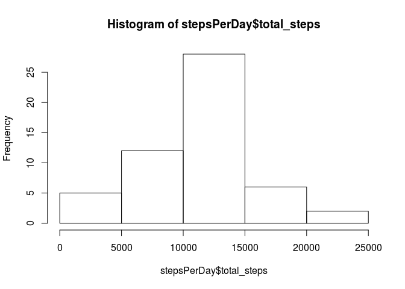
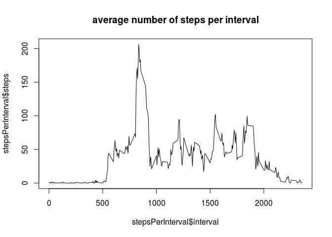
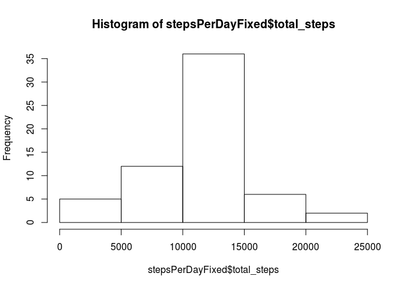
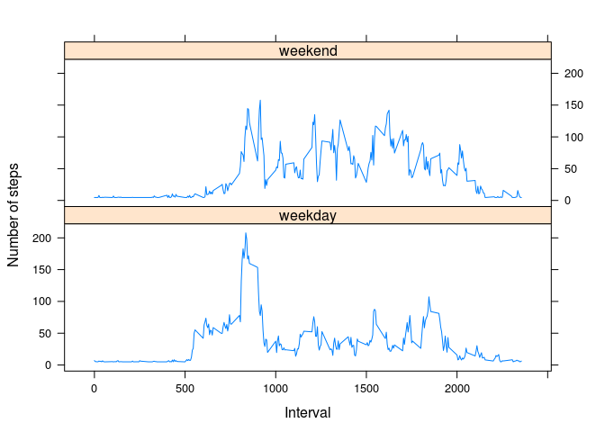

# Reproducible Research: Peer Assessment 1
Yew Choong CHEW  
17/10/2015  

## Loading and preprocessing the data

Load the data and then transform the date variable to proper format.

```r
activity <- read.csv('activity.csv')
activity$date <- as.Date(factor(activity$date))
```

## What is mean total number of steps taken per day?

For this part of the assignment, you can ignore the missing values in the dataset.

Calculate the total number of steps taken per day.

```r
stepsPerDay <- aggregate(steps ~ date, data = activity, FUN = sum)
names(stepsPerDay) <- c('date', 'total_steps')
head(stepsPerDay)
```

```
##         date total_steps
## 1 2012-10-02         126
## 2 2012-10-03       11352
## 3 2012-10-04       12116
## 4 2012-10-05       13294
## 5 2012-10-06       15420
## 6 2012-10-07       11015
```

Make a histogram of the total number of steps taken each day.

```r
hist(stepsPerDay$total_steps)
```

 

Calculate and report the mean and median of the total number of steps taken per day.

```r
meanPerDay <- aggregate(activity$steps, by = list(activity$date), FUN = mean)
head(meanPerDay)
```

```
##      Group.1        x
## 1 2012-10-01       NA
## 2 2012-10-02  0.43750
## 3 2012-10-03 39.41667
## 4 2012-10-04 42.06944
## 5 2012-10-05 46.15972
## 6 2012-10-06 53.54167
```

```r
medianPerDay <- aggregate(activity$steps, by = list(activity$date), FUN = median)
head(medianPerDay)
```

```
##      Group.1  x
## 1 2012-10-01 NA
## 2 2012-10-02  0
## 3 2012-10-03  0
## 4 2012-10-04  0
## 5 2012-10-05  0
## 6 2012-10-06  0
```

Calculate and report the mean and median of the total number of steps.

```r
meanOfSteps <- mean(stepsPerDay$total_steps)
meanOfSteps
```

```
## [1] 10766.19
```

```r
medianOfSteps <- median(stepsPerDay$total_steps)
medianOfSteps
```

```
## [1] 10765
```

## What is the average daily activity pattern?

Make a time series plot (i.e. type = "l") of the 5-minute interval (x-axis) and the average number of steps taken, averaged across all days (y-axis).

```r
stepsPerInterval <- aggregate(steps ~ interval, data = activity, FUN = mean)
head(stepsPerInterval)
```

```
##   interval     steps
## 1        0 1.7169811
## 2        5 0.3396226
## 3       10 0.1320755
## 4       15 0.1509434
## 5       20 0.0754717
## 6       25 2.0943396
```

```r
plot(stepsPerInterval$interval, stepsPerInterval$steps,
     type = 'l', main = 'average number of steps per interval')
```

 

Which 5-minute interval, on average across all the days in the dataset, contains the maximum number of steps?

```r
stepsPerInterval[which.max(stepsPerInterval$steps),]$interval
```

```
## [1] 835
```

## Imputing missing values

Calculate and report the total number of missing values in the dataset (i.e. the total number of rows with NAs).

```r
naIndexes <- is.na(activity$steps)
sum(naIndexes)
```

```
## [1] 2304
```

Devise a strategy for filling in all of the missing values in the dataset. The strategy does not need to be sophisticated. For example, I use the mean of the day. Create a new dataset that is equal to the original dataset but with the missing data filled in.

```r
intervalPerDay = sum(activity$date == "2012-10-01")
activityFixed <- activity
activityFixed[naIndexes, ]$steps = meanOfSteps / intervalPerDay
# sum of 0 confirm no more missing values
sum(is.na(activityFixed$steps))
```

```
## [1] 0
```

Make a histogram of the total number of steps taken each day.

```r
stepsPerDayFixed <- aggregate(steps ~ date, data = activityFixed, FUN = sum)
names(stepsPerDayFixed) <- c('date', 'total_steps')
head(stepsPerDayFixed)
```

```
##         date total_steps
## 1 2012-10-01    10766.19
## 2 2012-10-02      126.00
## 3 2012-10-03    11352.00
## 4 2012-10-04    12116.00
## 5 2012-10-05    13294.00
## 6 2012-10-06    15420.00
```

```r
hist(stepsPerDayFixed$total_steps)
```

 

Calculate and report the mean and median total number of steps taken per day.

```r
meanPerDayFixed <- aggregate(activityFixed$steps, by = list(activityFixed$date), FUN = mean)
head(meanPerDayFixed)
```

```
##      Group.1        x
## 1 2012-10-01 37.38260
## 2 2012-10-02  0.43750
## 3 2012-10-03 39.41667
## 4 2012-10-04 42.06944
## 5 2012-10-05 46.15972
## 6 2012-10-06 53.54167
```

```r
medianPerDayFixed <- aggregate(activityFixed$steps, by = list(activityFixed$date), FUN = median)
head(medianPerDayFixed)
```

```
##      Group.1       x
## 1 2012-10-01 37.3826
## 2 2012-10-02  0.0000
## 3 2012-10-03  0.0000
## 4 2012-10-04  0.0000
## 5 2012-10-05  0.0000
## 6 2012-10-06  0.0000
```

Calculate and report the mean and median of the total number of steps.

```r
meanOfStepsFixed <- mean(stepsPerDayFixed$total_steps)
meanOfStepsFixed
```

```
## [1] 10766.19
```

```r
medianOfStepsFixed <- median(stepsPerDayFixed$total_steps)
medianOfStepsFixed
```

```
## [1] 10766.19
```

Do these values differ from the estimates from the first part of the assignment? What is the impact of imputing missing data on the estimates of the total daily number of steps?

```r
meanOfStepsFixed - meanOfSteps
```

```
## [1] 0
```

```r
medianOfStepsFixed - medianOfSteps
```

```
## [1] 1.188679
```
*Answer*: Mean values are same but therer is a slight difference in meadian value.
 
## Are there differences in activity patterns between weekdays and weekends?

For this part the weekdays() function may be of some help here. Use the dataset with the filled-in missing values for this part.

Create a new factor variable in the dataset with two levels – “weekday” and “weekend” indicating whether a given date is a weekday or weekend day.

```r
activityFixed$weekday <- weekdays(activityFixed$date)
activityFixed[activityFixed$weekday %in% c('Saturday', 'Sunday'), ]$weekday <- 'weekend'
activityFixed[activityFixed$weekday != 'weekend', ]$weekday <- 'weekday'
activityFixed$weekday <- as.factor(activityFixed$weekday)
```

Make a panel plot containing a time series plot (i.e. type = “l”) of the 5-minute interval (x-axis) and the average number of steps taken, averaged across all weekday days or weekend days (y-axis). See the README file in the GitHub repository to see an example of what this plot should look like using simulated data.

```r
if (!require(lattice)){
  install.packages('lattice', dependencies = TRUE)
  require(lattice)
}
```

```
## Loading required package: lattice
```

```r
stepsPerIntervalFixed <- aggregate(steps ~ interval + weekday, activityFixed, mean)
xyplot(steps ~ interval | weekday, data = stepsPerIntervalFixed, type = "l", layout = c(1, 2), 
    xlab = "Interval", ylab = "Number of steps")
```

 
